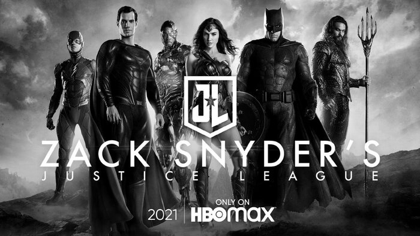

# Justice-League
<!DOCTYPE html>
<html lang="en">
<head>
    <meta charset="UTF-8">
    <meta http-equiv="X-UA-Compatible" content="IE=edge">
    <meta name="viewport" content="width=device-width, initial-scale=1.0">
    <title>Document</title>
</head>
<body>
    <h1>«Лига справедливости» Зака Снайдера: фанаты «продавили» студию Warner Bros.</h1>
    <h2>Фильм появится на экранах в 2021 году</h2>
    
    
Режиссёр Зак Снайдер объявил, что его версия фильма «Лига справедливости» будет опубликована в 2021 году на стриминговом сервисе HBO Max, который вскоре начнёт свою работу. По словам Снайдера, зрители увидят совершенно другой кинокомикс, особенно если сравнивать его с кинотеатральной версией, доступной всему миру. Уже в ближайшее время режиссёр воссоединится с командой, помогавшей ему во время съёмочного периода, чтобы завершить этап постпродакшена, – нужно доделать визуальные эффекты, а также дозаписать отсутствующие диалоги. Вероятнее всего, к работе будут привлечены и исполнители главных ролей. По данным издания The Hollywood Reporter, студия Warner Bros. выделит дополнительно ещё $20-30 млн. В итоге зрители увидят или четырёхчасовую кинокартину (ранее Снайдер сообщал, что именно такой хронометраж он планировал для «Лиги справедливости») или мини-сериал.

    <a href="https://www.filmpro.ru/materials/72304">Информация взята из </a>
</body>
</html>
